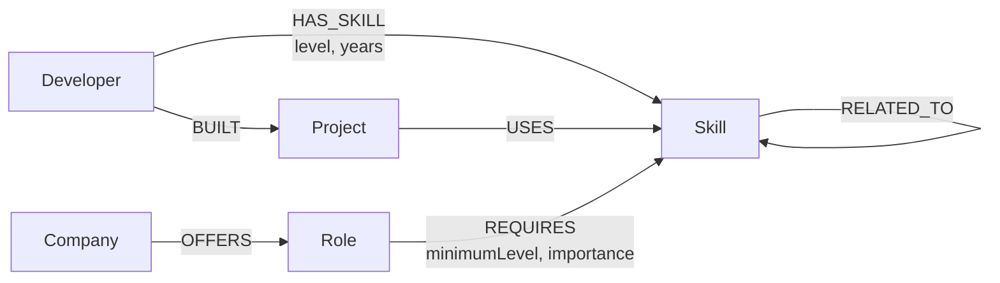

# SkillGraph

SkillGraph is a graph-powered career and skill path explorer. It will help people understand how their skills and projects connect to roles, career paths, and companies using CognoDB relationships.

## Current development status

Phase 1 (foundation) is complete and the live CognoDB connection has been verified. Phase 2 (graph model, seed data, seed script, query layer) is complete and merged. Phase 3 — API routes exposing the query/service layer to the application — is complete in code; see the API Layer section below. Live verification of both phases against the hosted CognoDB instance is still pending (see the Seed Data and API Layer sections for why). Phase 4 — the polished frontend/UI — is the next implementation phase.

New contributors and AI coding agents should read [PROJECT_HANDOFF.md](PROJECT_HANDOFF.md) first. It documents the assessment requirements, the graph model, the phase plan, the secrets policy, and the rules for continuing this project.

Phase 1 established the application foundation:

- Next.js App Router with TypeScript
- Tailwind CSS and ESLint
- validated server-side CognoDB configuration
- lazy Neo4j driver initialization for CognoDB over Bolt
- a read-session helper that always closes sessions
- a parameterized database health check at `GET /api/health`

Phase 2 added the graph data model, realistic seed data, an idempotent seed script, and a foundational query layer:

- typed node/relationship models in `src/lib/types/graph.ts`
- realistic seed data in `data/seed-data.ts` (18 Developers, 35 Skills, 18 Projects, 12 Roles, 9 Companies)
- an idempotent seed script (`npm run seed`) that creates constraints/indexes and MERGEs nodes and relationships
- a parameterized query layer in `src/lib/queries/`, including a 2-hop traversal and a shortest-path career query
- a thin service layer in `src/lib/services/` wrapping the query layer for future API routes

Phase 3 exposed the graph functionality through a server/API layer, keeping the architecture `UI -> API/server -> service layer -> query layer -> CognoDB` and Cypher confined entirely to the query layer:

- foundational lookups added to the query layer: `getDeveloperById`, `getDeveloperProjects`, `getRoleById`, `getRoleRequirements`
- role matching upgraded to a product-friendly result (match percentage, matched skills, missing skill count)
- project-derived skill evidence (`directSkills` / `projectDerivedSkills` / `projectDerivedOnlySkills`) exposed as its own result
- a composed role-detail-for-developer service result (requirements, matches, gaps, companies, career path) built by calling several focused queries rather than one large one
- the career-path traversal wrapped into an application-friendly shape (`startingSkill`, `targetSkill`, `steps`, `hopCount`)
- seven Next.js API routes under `src/app/api/developers/`, using a shared `{ data }` / `{ error }` response shape, Zod-validated route parameters, and sanitized error handling

The polished frontend/UI is reserved for a later phase.

## Why a Graph Database?

SkillGraph's core question — "how do this developer's skills and projects connect to a career path?" — is a question about relationships, not records, so it is modeled as a graph rather than as a set of independent tables.

- A developer connects to many skills (`HAS_SKILL`), each with its own strength (`level`, `years`). That is already a many-to-many relationship with properties, not a foreign key.
- A project connects a developer to the technologies they actually used (`BUILT` then `USES`), which is a second, independent path to "skill" evidence — inferred exposure through real work, distinct from self-reported `HAS_SKILL`.
- A role connects to the skills it requires (`REQUIRES`), each with its own bar (`minimumLevel`, `importance`).
- A company connects to the roles it offers (`OFFERS`).
- A skill connects to related skills (`RELATED_TO`), forming a skill-adjacency network independent of any developer or role.

Answering "which roles fit this developer" or "what should this developer learn next" means walking across several of these relationship types in one traversal: `Developer → HAS_SKILL → Skill ← REQUIRES ← Role`, or `Developer → HAS_SKILL → Skill → RELATED_TO → Skill ← REQUIRES ← Role`. In a relational schema this would require joining developer_skills, projects, project_skills, role_skills, and skill_relations tables, with the number of joins fixed in advance — and a variable-length "skill is related to a skill that is related to a skill required by a role" traversal (the career-path query) simply isn't expressible as a bounded set of joins at all. In the graph, both are a single Cypher pattern: relationships are traversed, not looked up by matching foreign keys across tables, so recommendations and skill-path discovery fall out of graph traversal rather than filtering independent tables.

## Graph Data Model

Every node uses a stable, application-level string `id` property (never the database's internal node id) as its identifier.



Key relationship properties:

- `HAS_SKILL`: `level` (`beginner` \| `intermediate` \| `advanced` \| `expert`), `years` (number)
- `REQUIRES`: `minimumLevel` (same scale as `level`), `importance` (`nice-to-have` \| `important` \| `critical`)

## Nodes

| Node | Why it's a node |
| --- | --- |
| `Developer` | The subject of every query — "what does this person know, and where could they go?" needs to be a first-class, addressable entity. |
| `Skill` | Skills are shared and cross-referenced by developers, projects, and roles alike, and skills relate to other skills (`RELATED_TO`) — a property on a row can't participate in relationships of its own. |
| `Project` | Projects are the evidence layer: they connect a developer to the skills they actually used, independent of what the developer claims to know. |
| `Role` | Roles are reusable targets that many developers can be matched against and many companies can offer — a node, not an attribute of a company. |
| `Company` | Companies group roles and are themselves a traversal target ("which companies offer roles that match me"). |

## Relationships

| Relationship | Meaning |
| --- | --- |
| `(:Developer)-[:HAS_SKILL]->(:Skill)` | The developer claims this skill, at a given `level` and `years` of experience. |
| `(:Developer)-[:BUILT]->(:Project)` | The developer built this project. |
| `(:Project)-[:USES]->(:Skill)` | The project used this skill — the basis for inferring skills from real work rather than self-reporting. |
| `(:Role)-[:REQUIRES]->(:Skill)` | The role requires this skill, at a given `minimumLevel` and `importance`. |
| `(:Company)-[:OFFERS]->(:Role)` | The company has openings for this role. |
| `(:Skill)-[:RELATED_TO]->(:Skill)` | The two skills are adjacent in practice (e.g. JavaScript → TypeScript, Docker → Kubernetes) — the basis for skill-path discovery. |

## Seed Data

```bash
npm run seed
```

`data/seed-data.ts` holds a deterministic, hand-written dataset, and `scripts/seed.ts` loads it idempotently: it first ensures constraints/indexes exist, then `MERGE`s every node and relationship keyed by its application-level `id` (or by both endpoint ids, for relationships). Because every write is a `MERGE` rather than a `CREATE`, running the script again updates the same nodes and relationships in place instead of duplicating them, and the script never wipes the database first.

Approximate current counts (exact, as of this dataset):

- Nodes: 18 Developer, 35 Skill, 18 Project, 12 Role, 9 Company
- Relationships: 76 `HAS_SKILL`, 19 `BUILT`, 54 `USES`, 48 `REQUIRES`, 23 `OFFERS`, 26 `RELATED_TO`

**Verification status:** `npm run seed` and the full query layer were integration-tested against a temporary, disposable Neo4j 5.26 instance (not the hosted CognoDB instance), confirming the script and queries are correct — running the seed twice produced identical counts, with no duplicates. Live CognoDB connectivity was previously confirmed separately during Phase 1 (`GET /api/health` returned `{"status":"ok","database":"reachable"}` against the real instance). Phase 2 live seed verification against the hosted CognoDB instance itself is still pending, because the current remote sandbox cannot open outbound Bolt (raw TCP) connections — CognoDB's documented application connection is Bolt via the official Neo4j driver, and this is a sandbox network limitation, not a code or credentials issue. Whoever has direct network access to the CognoDB instance should run `npm run seed` and confirm the same counts.

## Important Cypher Queries

All queries are parameterized (`$developerId`, `$roleId`, etc.) rather than built by string concatenation, so that user-supplied values are always sent as Cypher parameters and never interpolated into the query text — this is what makes the queries safe against Cypher injection, the same reason SQL uses bind parameters instead of concatenated strings.

**1. Developer skills** (`src/lib/queries/developer.ts`, `getDeveloperSkills`) — direct lookup:

```cypher
MATCH (d:Developer {id: $developerId})-[r:HAS_SKILL]->(s:Skill)
RETURN s.id AS id, s.name AS name, s.category AS category,
       r.level AS level, r.years AS years
```

**2. Skills inferred from projects** (`getSkillsInferredFromProjects`) — 2-hop traversal surfacing skills the developer has practical exposure to, even without a direct `HAS_SKILL`:

```cypher
MATCH (d:Developer {id: $developerId})-[:BUILT]->(:Project)-[:USES]->(s:Skill)
RETURN DISTINCT s.id AS id, s.name AS name, s.category AS category
```

**3. Role matching** (`src/lib/queries/role.ts`, `getMatchingRolesForDeveloper`) — for every role, counts how many of its required skills the developer already has, via the pattern `Developer → HAS_SKILL → Skill ← REQUIRES ← Role`:

```cypher
MATCH (r:Role)-[:REQUIRES]->(required:Skill)
OPTIONAL MATCH (d:Developer {id: $developerId})-[:HAS_SKILL]->(required)
WITH r, count(required) AS requiredSkillCount, count(d) AS matchedSkillCount
RETURN r.id AS id, r.title AS title, r.seniority AS seniority,
       matchedSkillCount, requiredSkillCount
ORDER BY matchedSkillCount DESC, requiredSkillCount ASC
```

The `OPTIONAL MATCH` on the developer side means a role is still returned (with `matchedSkillCount = 0`) even when the developer has none of its required skills, so every role can be ranked in one pass.

**4. Skill gap** (`getSkillGapForRole`) — required skills the developer does not yet have:

```cypher
MATCH (r:Role {id: $roleId})-[req:REQUIRES]->(s:Skill)
WHERE NOT (:Developer {id: $developerId})-[:HAS_SKILL]->(s)
RETURN s.id AS id, s.name AS name, req.minimumLevel AS minimumLevel, req.importance AS importance
```

**5. Company lookup** (`src/lib/queries/company.ts`, `getCompaniesOfferingRole`) — 1-hop:

```cypher
MATCH (c:Company)-[:OFFERS]->(:Role {id: $roleId})
RETURN c.id AS id, c.name AS name, c.industry AS industry
```

**6. Career skill path** (`src/lib/queries/careerPath.ts`, `findSkillPathToRole`) — bounded shortest traversal across `RELATED_TO` skills between something the developer already has and something the target role requires:

```cypher
MATCH (d:Developer {id: $developerId})-[:HAS_SKILL]->(start:Skill)
MATCH (r:Role {id: $roleId})-[:REQUIRES]->(target:Skill)
MATCH path = shortestPath((start)-[:RELATED_TO*0..4]-(target))
RETURN [node IN nodes(path) | node.id] AS ids, [node IN nodes(path) | node.name] AS names
ORDER BY length(path) ASC
LIMIT 1
```

See **Career Path Query** below for the details of the `*0..4` bound and the undirected traversal.

## Career Path Query

`findSkillPathToRole` uses:

```cypher
shortestPath((start)-[:RELATED_TO*0..4]-(target))
```

- `*0..4` searches paths of zero to four `RELATED_TO` relationships — `0` allows the trivial case where the developer's own skill is itself one of the role's required skills (no traversal needed); `4` is a deliberate upper bound, not a default: it prevents uncontrolled traversal across the entire skill graph, keeps the returned path short enough for a user to actually read and act on, and keeps this demo-scale query's cost bounded and predictable.
- `-[:RELATED_TO]-` (no arrow) traverses the relationship in either direction. `RELATED_TO` is stored as directed edges in the seed data (e.g. `JavaScript → TypeScript`), but relatedness between skills is conceptually symmetric — a developer moving from TypeScript toward JavaScript is just as valid a path as the reverse — so the query intentionally ignores the stored direction and matches either way.

## CognoDB Compatibility Note

`src/lib/db/schema.ts` uses:

```cypher
CREATE CONSTRAINT developer_id_unique IF NOT EXISTS FOR (n:Developer) REQUIRE n.id IS UNIQUE
```

(one such constraint per node label). This syntax was validated by running it, along with the full seed script and query layer, against a temporary Neo4j 5.26 instance. It has **not** been executed against the hosted CognoDB instance from this sandbox, because this environment cannot open outbound Bolt connections to any host, hosted CognoDB included. No claim is made that this constraint syntax has been verified against CognoDB itself — that verification is still pending and should be done by whoever has direct network access to the instance.

## API Layer

The application talks to CognoDB only through this pipeline:

```
UI  ->  API route (src/app/api)  ->  service layer (src/lib/services)  ->  query layer (src/lib/queries)  ->  CognoDB
```

Cypher lives only in `src/lib/queries/`. Route handlers and the service layer never see a Neo4j `Session`, `Record`, `Node`, or `Integer` — the query layer always returns plain typed objects (numbers extracted with `.toNumber()`, node/relationship properties mapped onto interfaces from `src/lib/types/graph.ts`).

### Endpoints

| Method & path | Returns |
| --- | --- |
| `GET /api/developers/[developerId]` | Developer profile |
| `GET /api/developers/[developerId]/skills` | Direct `HAS_SKILL` skills |
| `GET /api/developers/[developerId]/projects` | Projects the developer built |
| `GET /api/developers/[developerId]/project-skills` | `{ directSkills, projectDerivedSkills, projectDerivedOnlySkills }` |
| `GET /api/developers/[developerId]/roles` | Ranked role matches |
| `GET /api/developers/[developerId]/roles/[roleId]` | Full role detail + skill gap for that developer |
| `GET /api/developers/[developerId]/roles/[roleId]/path` | Career skill path to that role |

Every route validates its dynamic `[...]` segments with Zod (`src/lib/http/params.ts` — must be a non-empty, lowercase, hyphenated identifier) before touching the database, and returns one of two shapes:

```json
{ "data": ... }
```
```json
{ "error": { "code": "NOT_FOUND", "message": "Developer not found." } }
```

Error codes used: `BAD_REQUEST` (400, malformed id), `NOT_FOUND` (404, developer or role does not exist), `SERVICE_UNAVAILABLE` (503, CognoDB unreachable). A route never returns a generic 500 — every CognoDB/driver failure is caught by `handleApiErrors` in `src/lib/http/response.ts`, logged server-side only, and turned into the sanitized 503 shape above; no stack trace, connection URI, username, or password ever reaches the response body.

### Empty states are not errors

- Developer or role doesn't exist → `404 NOT_FOUND`.
- Developer exists but has no skills, no matching roles, or a role has no companies → `200` with an empty array — a real, meaningful result, not an error.
- No career-path connection exists within the traversal bound → `200` with `{ "found": false, "path": null }` — this is an expected graph outcome (see Career Path Query above), not a failure.
- CognoDB unreachable → `503 SERVICE_UNAVAILABLE` for every affected route.

### Role matching

`getMatchingRoles` (service layer) takes the raw per-role counts from the query layer and adds the product-facing fields:

```ts
matchPercentage = requiredSkillCount === 0 ? 0 : Math.round((matchedSkillCount / requiredSkillCount) * 100)
missingSkillCount = requiredSkillCount - matchedSkillCount
```

Each result also carries `matchedSkills` (id/name pairs) straight from the query layer, so a UI can show *which* skills matched without a second request. Ordering is deterministic: `matchedSkillCount DESC, requiredSkillCount ASC, title ASC` — ties are always broken the same way.

### Project-derived skills

`getDeveloperSkillEvidence` (service layer) calls `getDeveloperSkills` (direct `HAS_SKILL`) and `getSkillsInferredFromProjects` (the `Developer -> BUILT -> Project -> USES -> Skill` 2-hop traversal) and diffs them by id to produce `projectDerivedOnlySkills` — skills the developer demonstrably used in a project but has not declared as a direct skill. This evidence is read-only: it is never written back as a `HAS_SKILL` relationship, because project exposure and self-declared proficiency are different claims.

### Role detail / skill gap

`getRoleDetailForDeveloper` composes the role profile, required skills, skill gap, offering companies, career path, and the developer's own skills through `Promise.all` over the existing focused queries/services, rather than one large aggregate Cypher query — each piece stays independently testable and readable.

### Career path

`getCareerPathToRole` wraps the existing bounded `shortestPath` traversal into `{ startingSkill, targetSkill, steps, hopCount }`. The response never implies the developer already has the intermediate or target skills — it represents a possible learning connection through the skill graph, not a guaranteed outcome.

## Tech stack

- Next.js 16
- React 19
- TypeScript
- Tailwind CSS 4
- CognoDB
- Official Neo4j JavaScript driver
- Zod

## Run locally

Prerequisites:

- Node.js 20 or newer
- A running CognoDB instance

Install dependencies:

```bash
npm install
```

Create your private local environment file:

```bash
cp .env.example .env.local
```

Replace the placeholder values in `.env.local` with the connection details from your CognoDB instance. Do not commit that file.

Start the development server:

```bash
npm run dev
```

Open [http://localhost:3000](http://localhost:3000). The database health endpoint is available at [http://localhost:3000/api/health](http://localhost:3000/api/health).

## Environment variables

| Variable | Purpose |
| --- | --- |
| `COGNODB_URI` | CognoDB Bolt connection URI |
| `COGNODB_USERNAME` | CognoDB username |
| `COGNODB_PASSWORD` | CognoDB password |

These variables are read only by server-side code. They do not use the `NEXT_PUBLIC_` prefix and are therefore not included in browser bundles.

## Health endpoint

`GET /api/health` opens a read session and runs this parameterized openCypher query:

```cypher
RETURN $status AS status
```

When CognoDB is reachable, the endpoint returns HTTP `200`. Missing configuration, authentication failures, and connection errors return HTTP `503` with a safe user-facing message. Raw database errors are never returned to the client.

## Verification

```bash
npm run lint
npm run typecheck
npm run build
```

The graph model, seed instructions, and query explanations are documented above. Screenshots, hosted demo, and screen-recording details will be documented as their implementation phases are completed.
