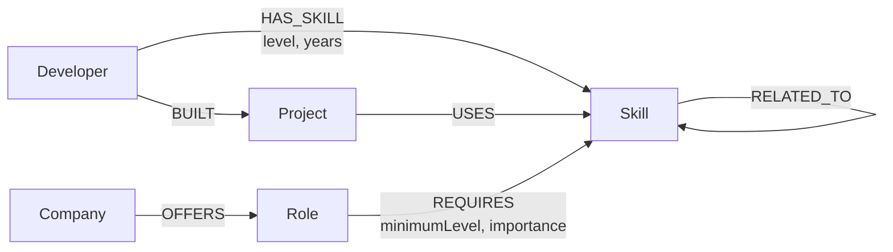
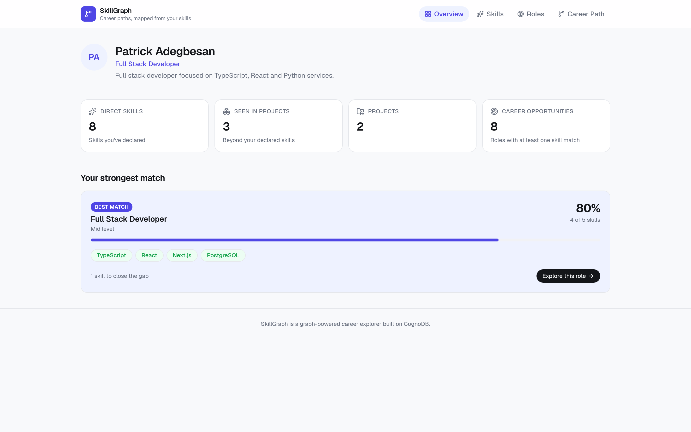
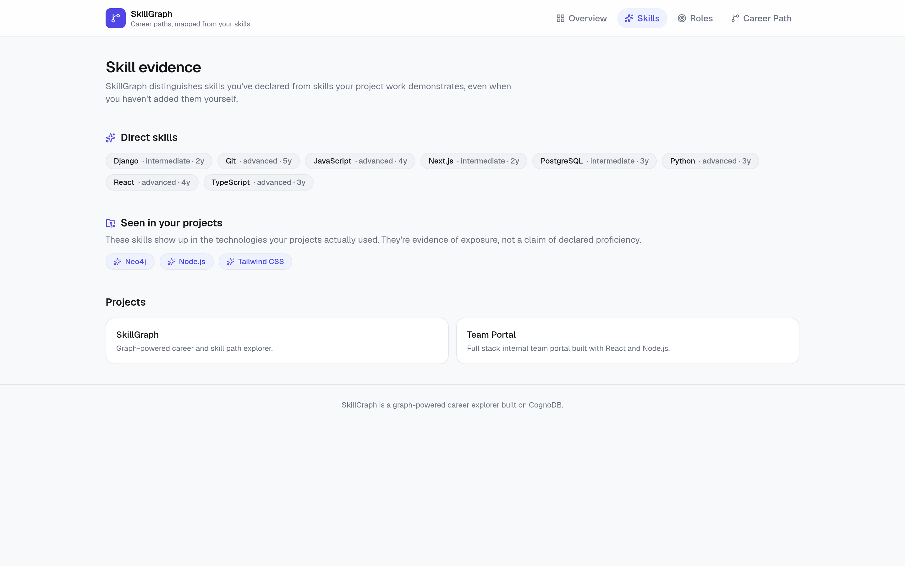
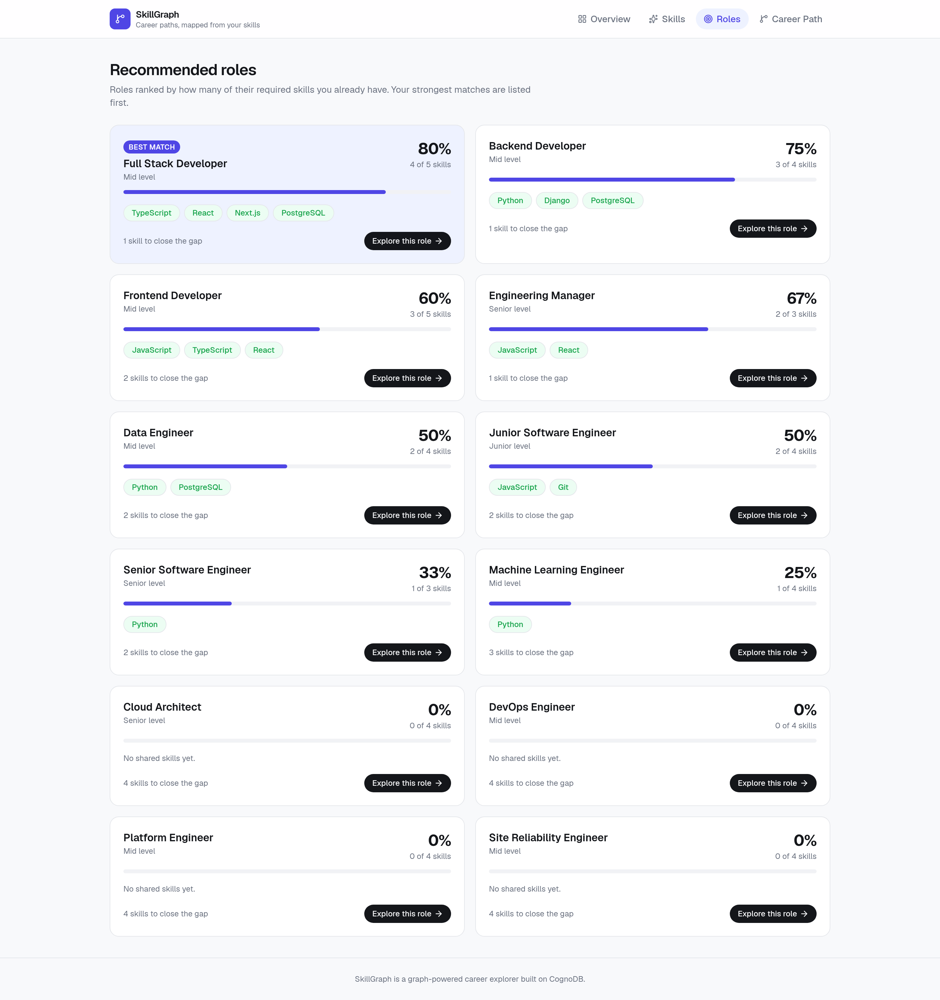
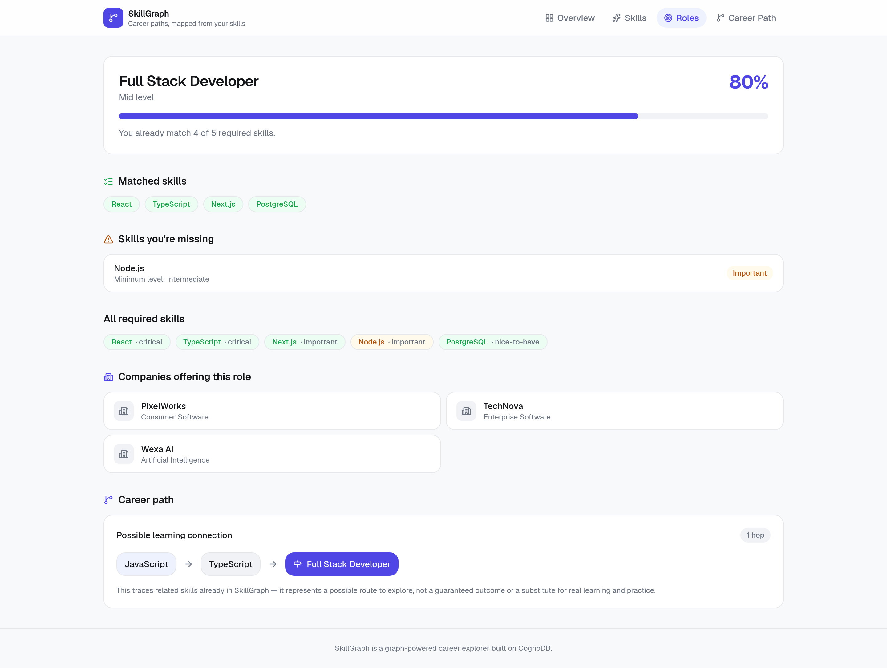
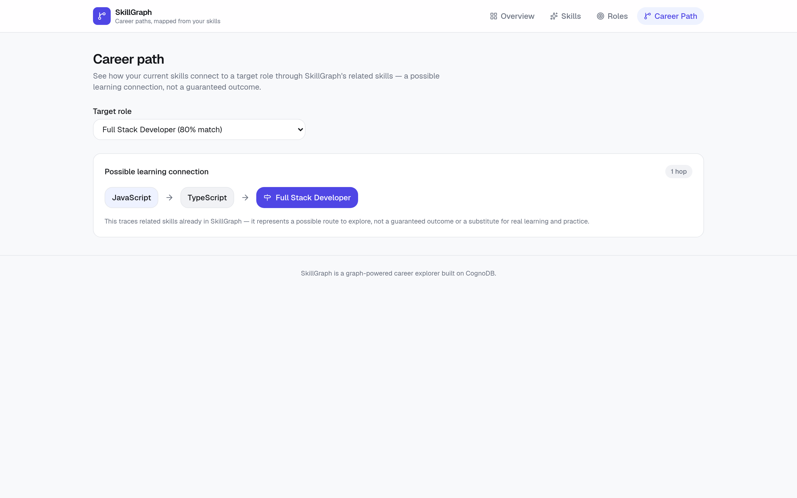

# SkillGraph

SkillGraph is a graph-powered career and skill path explorer. It will help people understand how their skills and projects connect to roles, career paths, and companies using CognoDB relationships.

## Use Case

This is a take-home assessment (Full Stack Developer Intern — CognoDB, Wexa AI) built around a real product idea: a developer should be able to see, at a glance, how their existing skills and project work connect to the roles and companies they might target next, and what the shortest realistic path is to close the gap. The demo persona is Patrick Adegbesan (`dev-patrick-adegbesan`), a full stack developer whose direct skills, project history, and best-matching role (Full Stack Developer, 80%) drive every screen in the app.

## Features

- **Skill evidence, two ways.** Skills a developer has declared are kept distinct from skills only evidenced by the projects they actually built. Project evidence is never silently promoted into a declared skill — it is exposure, not a proficiency claim.
- **Role matching.** Every role is scored by how many of its required skills the developer already has, ranked best-match first, with match percentage, matched skills, and the remaining gap.
- **Skill gap analysis.** For any role: what is matched, what is missing, each requirement's minimum level and importance, and which companies offer that role.
- **Career paths.** A bounded traversal across related skills from what the developer knows toward what a target role requires, presented as a possible learning connection rather than a guarantee.
- **Graceful degradation.** Loading skeletons, empty states distinct from errors, sanitized database-failure messages, and a health endpoint.

The demo runs with no login, defaulting to the persona `dev-patrick-adegbesan`.

## How It's Built

Layering is strict — `UI -> API route -> service -> query layer -> CognoDB` — and Cypher never appears outside the query layer or inside a React component.

| Layer | Location | Responsibility |
| --- | --- | --- |
| UI | `src/app/`, `src/components/` | Pages and presentational components. A single `useApiResource` hook is the only place the frontend calls `fetch`. |
| API | `src/app/api/developers/` | Seven routes sharing a `{ data }` / `{ error }` envelope, with Zod-validated route parameters and sanitized errors. |
| Service | `src/lib/services/` | Composes focused queries into view-shaped results; derives match percentages and skill gaps. |
| Query | `src/lib/queries/` | Parameterized Cypher only. Each function takes a `Session` and returns typed rows. |
| Data access | `src/lib/db/` | Lazy Neo4j driver for CognoDB over Bolt, plus read/write session helpers that always close in a `finally`. |

Supporting pieces: typed graph models in `src/lib/types/graph.ts`, seed data in `data/seed-data.ts` (18 Developers, 35 Skills, 18 Projects, 12 Roles, 9 Companies), and an idempotent seed script (`npm run seed`) that creates constraints then `MERGE`s nodes and relationships, so re-running it never duplicates or wipes data.

Credentials are read only on the server, validated at startup, and never exposed to the browser.

## Why a Graph Database?

SkillGraph's core question — "how do this developer's skills and projects connect to a career path?" — is a question about relationships, not records, so it is modeled as a graph rather than as a set of independent tables.

- A developer connects to many skills (`HAS_SKILL`), each with its own strength (`level`, `years`). That is already a many-to-many relationship with properties, not a foreign key.
- A project connects a developer to the technologies they actually used (`BUILT` then `USES`), which is a second, independent path to "skill" evidence — inferred exposure through real work, distinct from self-reported `HAS_SKILL`.
- A role connects to the skills it requires (`REQUIRES`), each with its own bar (`minimumLevel`, `importance`).
- A company connects to the roles it offers (`OFFERS`).
- A skill connects to related skills (`RELATED_TO`), forming a skill-adjacency network independent of any developer or role.

Answering "which roles fit this developer" or "what should this developer learn next" means walking across several of these relationship types in one traversal: `Developer → HAS_SKILL → Skill ← REQUIRES ← Role`, or `Developer → HAS_SKILL → Skill → RELATED_TO → Skill ← REQUIRES ← Role`. In a relational schema this would require joining developer_skills, projects, project_skills, role_skills, and skill_relations tables, with the number of joins fixed in advance — and a variable-length "skill is related to a skill that is related to a skill required by a role" traversal (the career-path query) simply isn't expressible as a bounded set of joins at all. In the graph, both are a single Cypher pattern: relationships are traversed, not looked up by matching foreign keys across tables, so recommendations and skill-path discovery fall out of graph traversal rather than filtering independent tables.

## Graph Data Model

Every node uses a stable, application-level string `id` property (never the database's internal node id) as its identifier.



Key relationship properties:

- `HAS_SKILL`: `level` (`beginner` \| `intermediate` \| `advanced` \| `expert`), `years` (number)
- `REQUIRES`: `minimumLevel` (same scale as `level`), `importance` (`nice-to-have` \| `important` \| `critical`)

## Nodes

| Node | Why it's a node |
| --- | --- |
| `Developer` | The subject of every query — "what does this person know, and where could they go?" needs to be a first-class, addressable entity. |
| `Skill` | Skills are shared and cross-referenced by developers, projects, and roles alike, and skills relate to other skills (`RELATED_TO`) — a property on a row can't participate in relationships of its own. |
| `Project` | Projects are the evidence layer: they connect a developer to the skills they actually used, independent of what the developer claims to know. |
| `Role` | Roles are reusable targets that many developers can be matched against and many companies can offer — a node, not an attribute of a company. |
| `Company` | Companies group roles and are themselves a traversal target ("which companies offer roles that match me"). |

## Relationships

| Relationship | Meaning |
| --- | --- |
| `(:Developer)-[:HAS_SKILL]->(:Skill)` | The developer claims this skill, at a given `level` and `years` of experience. |
| `(:Developer)-[:BUILT]->(:Project)` | The developer built this project. |
| `(:Project)-[:USES]->(:Skill)` | The project used this skill — the basis for inferring skills from real work rather than self-reporting. |
| `(:Role)-[:REQUIRES]->(:Skill)` | The role requires this skill, at a given `minimumLevel` and `importance`. |
| `(:Company)-[:OFFERS]->(:Role)` | The company has openings for this role. |
| `(:Skill)-[:RELATED_TO]->(:Skill)` | The two skills are adjacent in practice (e.g. JavaScript → TypeScript, Docker → Kubernetes) — the basis for skill-path discovery. |

## Seed Data

```bash
npm run seed
```

`data/seed-data.ts` holds a deterministic, hand-written dataset, and `scripts/seed.ts` loads it idempotently: it first ensures constraints/indexes exist, then `MERGE`s every node and relationship keyed by its application-level `id` (or by both endpoint ids, for relationships). Because every write is a `MERGE` rather than a `CREATE`, running the script again updates the same nodes and relationships in place instead of duplicating them, and the script never wipes the database first.

Approximate current counts (exact, as of this dataset):

- Nodes: 18 Developer, 35 Skill, 18 Project, 12 Role, 9 Company
- Relationships: 76 `HAS_SKILL`, 19 `BUILT`, 54 `USES`, 48 `REQUIRES`, 23 `OFFERS`, 26 `RELATED_TO`

**Verification status:** `npm run seed` has been run against the **hosted CognoDB instance** from a local development machine. It was run twice back-to-back; the second run produced identical counts with no duplicates, confirming `MERGE`-based idempotency. Counts read back from the live instance after both runs:

| Nodes | Count | | Relationships | Count |
| --- | --- | --- | --- | --- |
| `Developer` | 18 | | `HAS_SKILL` | 76 |
| `Skill` | 35 | | `BUILT` | 19 |
| `Project` | 18 | | `USES` | 54 |
| `Role` | 12 | | `REQUIRES` | 48 |
| `Company` | 9 | | `OFFERS` | 23 |
| **Total** | **92** | | `RELATED_TO` | 26 |
| | | | **Total** | **246** |

## Important Cypher Queries

All queries are parameterized (`$developerId`, `$roleId`, etc.) rather than built by string concatenation, so that user-supplied values are always sent as Cypher parameters and never interpolated into the query text — this is what makes the queries safe against Cypher injection, the same reason SQL uses bind parameters instead of concatenated strings.

**1. Developer skills** (`src/lib/queries/developer.ts`, `getDeveloperSkills`) — direct lookup:

```cypher
MATCH (d:Developer {id: $developerId})-[r:HAS_SKILL]->(s:Skill)
RETURN s.id AS id, s.name AS name, s.category AS category,
       r.level AS level, r.years AS years
```

**2. Skills inferred from projects** (`getSkillsInferredFromProjects`) — 2-hop traversal surfacing skills the developer has practical exposure to, even without a direct `HAS_SKILL`:

```cypher
MATCH (d:Developer {id: $developerId})-[:BUILT]->(:Project)-[:USES]->(s:Skill)
RETURN DISTINCT s.id AS id, s.name AS name, s.category AS category
```

**3. Role matching** (`src/lib/queries/role.ts`, `getMatchingRolesForDeveloper`) — for every role, counts how many of its required skills the developer already has, via the pattern `Developer → HAS_SKILL → Skill ← REQUIRES ← Role`:

```cypher
MATCH (r:Role)-[:REQUIRES]->(required:Skill)
OPTIONAL MATCH (d:Developer {id: $developerId})-[:HAS_SKILL]->(required)
WITH r, count(required) AS requiredSkillCount, count(d) AS matchedSkillCount
RETURN r.id AS id, r.title AS title, r.seniority AS seniority,
       matchedSkillCount, requiredSkillCount
ORDER BY matchedSkillCount DESC, requiredSkillCount ASC
```

The `OPTIONAL MATCH` on the developer side means a role is still returned (with `matchedSkillCount = 0`) even when the developer has none of its required skills, so every role can be ranked in one pass.

**4. Skill gap** (`getSkillGapForRole`) — required skills the developer does not yet have:

```cypher
MATCH (r:Role {id: $roleId})-[req:REQUIRES]->(s:Skill)
WHERE NOT (:Developer {id: $developerId})-[:HAS_SKILL]->(s)
RETURN s.id AS id, s.name AS name, req.minimumLevel AS minimumLevel, req.importance AS importance
```

**5. Company lookup** (`src/lib/queries/company.ts`, `getCompaniesOfferingRole`) — 1-hop:

```cypher
MATCH (c:Company)-[:OFFERS]->(:Role {id: $roleId})
RETURN c.id AS id, c.name AS name, c.industry AS industry
```

**6. Career skill path** (`src/lib/queries/careerPath.ts`, `findSkillPathToRole`) — bounded shortest traversal across `RELATED_TO` skills between something the developer already has and something the target role requires:

```cypher
MATCH (d:Developer {id: $developerId})-[:HAS_SKILL]->(start:Skill)
MATCH (r:Role {id: $roleId})-[:REQUIRES]->(target:Skill)
MATCH path = shortestPath((start)-[:RELATED_TO*0..4]-(target))
RETURN [node IN nodes(path) | node.id] AS ids, [node IN nodes(path) | node.name] AS names
ORDER BY length(path) ASC
LIMIT 1
```

See **Career Path Query** below for the details of the `*0..4` bound and the undirected traversal.

## Career Path Query

`findSkillPathToRole` uses:

```cypher
shortestPath((start)-[:RELATED_TO*0..4]-(target))
```

- `*0..4` searches paths of zero to four `RELATED_TO` relationships — `0` allows the trivial case where the developer's own skill is itself one of the role's required skills (no traversal needed); `4` is a deliberate upper bound, not a default: it prevents uncontrolled traversal across the entire skill graph, keeps the returned path short enough for a user to actually read and act on, and keeps this demo-scale query's cost bounded and predictable.
- `-[:RELATED_TO]-` (no arrow) traverses the relationship in either direction. `RELATED_TO` is stored as directed edges in the seed data (e.g. `JavaScript → TypeScript`), but relatedness between skills is conceptually symmetric — a developer moving from TypeScript toward JavaScript is just as valid a path as the reverse — so the query intentionally ignores the stored direction and matches either way.

## CognoDB Compatibility Note

`src/lib/db/schema.ts` uses:

```cypher
CREATE CONSTRAINT developer_id_unique IF NOT EXISTS FOR (n:Developer) REQUIRE n.id IS UNIQUE
```

(one such constraint per node label). This syntax has been **executed successfully against the hosted CognoDB instance** — `npm run seed` runs `ensureSchema` first and completed without error on both runs, so CognoDB accepts this constraint syntax.

### Expressing anti-joins

Live verification against the hosted instance surfaced one compatibility detail worth recording, since it shaped how the query layer expresses "required skills the developer does not have".

On CognoDB, a **pattern-existence predicate used inside a `WHERE` clause** did not behave as it does on Neo4j: rather than matching, it evaluated as `false`, and no error was raised. Each of the following returned `0` rows against the hosted instance, where the equivalent Neo4j query returns the 4 matching skills:

```cypher
WHERE (:Developer {id: $developerId})-[:HAS_SKILL]->(s)   -- anonymous node, inline property
WHERE (d)-[:HAS_SKILL]->(s)                               -- bound variable
WHERE (:Developer)-[:HAS_SKILL]->(s)                      -- label only
WHERE exists { MATCH (:Developer {id: $id})-[:HAS_SKILL]->(s) }
WHERE EXISTS((:Developer {id: $id})-[:HAS_SKILL]->(s))
```

Since the positive form evaluated as `false`, the negated form (`WHERE NOT (...)`) evaluated as `true` for every row. `getSkillGapForRole` originally used `WHERE NOT (:Developer {id: $developerId})-[:HAS_SKILL]->(s)`, so on CognoDB it reported *every* required skill as missing and the role detail view showed `0%`.

The anti-join is instead expressed with `OPTIONAL MATCH` + `IS NULL`, which CognoDB evaluates as expected:

```cypher
MATCH (r:Role {id: $roleId})-[req:REQUIRES]->(s:Skill)
OPTIONAL MATCH (d:Developer {id: $developerId})-[:HAS_SKILL]->(s)
WITH s, req, d
WHERE d IS NULL
RETURN s.id AS id, s.name AS name, s.category AS category,
       req.minimumLevel AS minimumLevel, req.importance AS importance
ORDER BY req.importance, s.name
```

This is the same idiom `getMatchingRolesForDeveloper` already used (`OPTIONAL MATCH` + `IS NOT NULL`), which is why the role *list* was correct throughout while the role *detail* was not — a useful reminder that verifying against the real target database catches what a local stand-in cannot. Everything else the project relies on behaves as expected on CognoDB: plain `MATCH` traversal, `OPTIONAL MATCH`, `shortestPath`, variable-length patterns, `UNWIND`/`MERGE`, constraint creation, and aggregation. **Convention for new queries in this project: express existence and absence with `OPTIONAL MATCH` plus `IS NOT NULL`/`IS NULL`.**

## API Layer

The application talks to CognoDB only through this pipeline:

```
UI  ->  API route (src/app/api)  ->  service layer (src/lib/services)  ->  query layer (src/lib/queries)  ->  CognoDB
```

Cypher lives only in `src/lib/queries/`. Route handlers and the service layer never see a Neo4j `Session`, `Record`, `Node`, or `Integer` — the query layer always returns plain typed objects (numbers extracted with `.toNumber()`, node/relationship properties mapped onto interfaces from `src/lib/types/graph.ts`).

### Endpoints

| Method & path | Returns |
| --- | --- |
| `GET /api/developers/[developerId]` | Developer profile |
| `GET /api/developers/[developerId]/skills` | Direct `HAS_SKILL` skills |
| `GET /api/developers/[developerId]/projects` | Projects the developer built |
| `GET /api/developers/[developerId]/project-skills` | `{ directSkills, projectDerivedSkills, projectDerivedOnlySkills }` |
| `GET /api/developers/[developerId]/roles` | Ranked role matches |
| `GET /api/developers/[developerId]/roles/[roleId]` | Full role detail + skill gap for that developer |
| `GET /api/developers/[developerId]/roles/[roleId]/path` | Career skill path to that role |

Every route validates its dynamic `[...]` segments with Zod (`src/lib/http/params.ts` — must be a non-empty, lowercase, hyphenated identifier) before touching the database, and returns one of two shapes:

```json
{ "data": ... }
```
```json
{ "error": { "code": "NOT_FOUND", "message": "Developer not found." } }
```

Error codes used: `BAD_REQUEST` (400, malformed id), `NOT_FOUND` (404, developer or role does not exist), `SERVICE_UNAVAILABLE` (503, CognoDB unreachable). A route never returns a generic 500 — every CognoDB/driver failure is caught by `handleApiErrors` in `src/lib/http/response.ts`, logged server-side only, and turned into the sanitized 503 shape above; no stack trace, connection URI, username, or password ever reaches the response body.

### Empty states are not errors

- Developer or role doesn't exist → `404 NOT_FOUND`.
- Developer exists but has no skills, no matching roles, or a role has no companies → `200` with an empty array — a real, meaningful result, not an error.
- No career-path connection exists within the traversal bound → `200` with `{ "found": false, "path": null }` — this is an expected graph outcome (see Career Path Query above), not a failure.
- CognoDB unreachable → `503 SERVICE_UNAVAILABLE` for every affected route.

### Role matching

`getMatchingRoles` (service layer) takes the raw per-role counts from the query layer and adds the product-facing fields:

```ts
matchPercentage = requiredSkillCount === 0 ? 0 : Math.round((matchedSkillCount / requiredSkillCount) * 100)
missingSkillCount = requiredSkillCount - matchedSkillCount
```

Each result also carries `matchedSkills` (id/name pairs) straight from the query layer, so a UI can show *which* skills matched without a second request. Ordering is deterministic: `matchedSkillCount DESC, requiredSkillCount ASC, title ASC` — ties are always broken the same way.

### Project-derived skills

`getDeveloperSkillEvidence` (service layer) calls `getDeveloperSkills` (direct `HAS_SKILL`) and `getSkillsInferredFromProjects` (the `Developer -> BUILT -> Project -> USES -> Skill` 2-hop traversal) and diffs them by id to produce `projectDerivedOnlySkills` — skills the developer demonstrably used in a project but has not declared as a direct skill. This evidence is read-only: it is never written back as a `HAS_SKILL` relationship, because project exposure and self-declared proficiency are different claims.

### Role detail / skill gap

`getRoleDetailForDeveloper` composes the role profile, required skills, skill gap, offering companies, career path, and the developer's own skills through `Promise.all` over the existing focused queries/services, rather than one large aggregate Cypher query — each piece stays independently testable and readable.

### Career path

`getCareerPathToRole` wraps the existing bounded `shortestPath` traversal into `{ startingSkill, targetSkill, steps, hopCount }`. The response never implies the developer already has the intermediate or target skills — it represents a possible learning connection through the skill graph, not a guaranteed outcome.

## Frontend

### Main user flow

The app opens directly into a useful demo state — no login, no id to type in — using `dev-patrick-adegbesan` as the default developer (`src/lib/constants.ts`). The intended flow:

```
Overview  ->  Skills  ->  Roles  ->  Role detail  ->  Career Path
```

Overview answers "what's my situation at a glance"; Skills answers "what do I actually know, and what does my project work show"; Roles answers "what fits me"; a role's detail page answers "what's the gap, and who's hiring"; Career Path answers "how do my current skills connect to a role I don't fully match yet." Nothing on any page requires the visitor to know what Cypher, a graph traversal, or CognoDB are — that language stays in this README and the code comments, not the UI.

### UI architecture

The frontend never imports the service or query layers, and never talks to CognoDB directly — every page goes through the same API routes documented above:

```
Page component (Client Component)  ->  useApiResource(path)  ->  fetch('/api/developers/...')  ->  API route  ->  service  ->  query  ->  CognoDB
```

`src/lib/api/useApiResource.ts` is the one place that calls `fetch`. It returns a small discriminated union (`{status: "loading"}` / `{status: "success", data}` / `{status: "error", code, message, httpStatus}`) plus a `refetch()` function, so every page renders its own loading/success/error UI from the same shape without duplicating fetch logic. Pages are Client Components (`"use client"`) specifically so they can show a real loading state between navigation and data arriving, rather than only a server-rendered final result.

Reusable presentation components live in `src/components/`: `AppShell` (branding + nav), `DeveloperHeader`, `MetricCard`, `SkillBadge`, `RoleMatchCard`, `MatchProgress`, `SkillGapList`, `CompanyList`, `CareerPathVisualization`, `EmptyState`, `ErrorState`, and the skeleton primitives in `LoadingSkeleton.tsx`. Design tokens (accent color, surface/border colors, radii) are defined as CSS variables in `src/app/globals.css`, with a dark-mode override via `prefers-color-scheme`, so components reference `var(--accent)`, `var(--surface)`, etc. instead of one-off Tailwind color values.

### Loading, empty, and error states

Every data-driven section has all three states, not just a happy path:

- **Loading** — skeleton placeholders (`CardSkeleton`, `ListSkeleton`, `MetricRowSkeleton`, `TextSkeleton`) shaped like the content that's about to appear, not a bare "Loading…" string.
- **Empty** — a meaningful, worded explanation via `EmptyState` for each case the API can legitimately return empty: no direct skills, no project-derived-only skills, no matching roles, no missing skills ("this developer already has every required skill listed for this role"), no companies offering a role, and no career path found (a dedicated message distinguishing "no short path exists yet" from an error).
- **Error** — `ErrorState` renders the API's sanitized message (never a raw driver/database error) with a "Try again" retry button that calls `refetch()`. A `404` (developer or role not found) renders its specific message without a retry button, since retrying a genuine not-found doesn't help; a `503` renders "SkillGraph is temporarily unavailable. Please try again." with a working retry.

### Career path visualization

`CareerPathVisualization` renders the bounded `RELATED_TO` traversal as a small, focused step diagram — skill pill, arrow, skill pill, ... , arrow, into the target role — rather than a large interactive graph library. Each step fades/slides in with a short staggered animation (disabled under `prefers-reduced-motion`). The component is explicit that this is "a possible learning connection," never a guarantee, and the empty state explains that no short path existing yet doesn't mean the role is out of reach. The dedicated `/career-path` page adds a role picker (defaulting to the developer's best match) so a visitor can explore the path toward any role, not just the top one; the same component is reused inside each role's detail page for that specific role.

## Screenshots

All captured from the deployed demo above, running against the hosted CognoDB instance.

### Overview

The developer's profile, summary metrics, and strongest role match.



### Skills

Declared skills separated from skills evidenced only by project work — Neo4j, Node.js and Tailwind CSS appear under "Seen in your projects" because they come from the two-hop `Developer -> BUILT -> Project -> USES -> Skill` traversal.



### Roles

Every role ranked by how many of its required skills the developer already has.



### Role detail

Matched skills, the specific gap, hiring companies, and the career path — Node.js is the single missing requirement.



### Career path

The bounded `RELATED_TO` traversal from a skill the developer already has toward the target role.



## Live Demo

**https://skillgraph.mr-path.site**

Publicly reachable, no login required. The deployed service connects to the same hosted CognoDB instance described below — the numbers on screen are live graph traversals, not fixtures.

Quick check:

```bash
curl -s https://skillgraph.mr-path.site/api/health
# {"status":"ok","database":"reachable"}
```

It runs on Google Cloud Run as a container built from the [`Dockerfile`](Dockerfile) in this repository (Next.js `output: "standalone"`, Node 20). The three CognoDB variables are injected at runtime from Google Secret Manager and are never baked into the image — see [`.dockerignore`](.dockerignore), which excludes every `.env*` file. The service scales to zero when idle, so a first request after a quiet period may take a few seconds to warm up.

## Local Setup

Prerequisites: Node.js 20 or newer, and a running CognoDB instance (or a compatible Neo4j instance for local development — see the CognoDB Compatibility Note above).

```bash
git clone https://github.com/patrickAdegbesan/skillgraph.git
cd skillgraph
npm install
```

Create your private local environment file:

```bash
cp .env.example .env.local
```

Edit `.env.local` with your own CognoDB connection details (never commit this file):

```bash
COGNODB_URI=
COGNODB_USERNAME=
COGNODB_PASSWORD=
```

Seed the database (idempotent — safe to run more than once) and start the dev server:

```bash
npm run seed
npm run dev
```

Open [http://localhost:3000](http://localhost:3000). The database health endpoint is available at [http://localhost:3000/api/health](http://localhost:3000/api/health).

Verify the code before or after making changes:

```bash
npm run lint
npm run typecheck
npm run build
```

`COGNODB_URI`, `COGNODB_USERNAME`, and `COGNODB_PASSWORD` are read only by server-side code. They do not use the `NEXT_PUBLIC_` prefix and are therefore never included in the browser bundle.

## Deploying

The deployed demo runs on Google Cloud Run as a container. The app must run as
a real Node.js server — every route under `/api` executes server-side and opens
a Bolt connection to CognoDB — so it is deliberately **not** a static export.

[`Dockerfile`](Dockerfile) builds a three-stage image using Next.js
`output: "standalone"`, so the runtime layer ships only the traced files rather
than the whole `node_modules` tree. It runs as a non-root user and honours the
`PORT` and `HOSTNAME` variables Cloud Run injects.

Credentials are never baked into the image: [`.dockerignore`](.dockerignore) and
[`.gcloudignore`](.gcloudignore) both exclude every `.env*` file, and the three
CognoDB values are stored in Google Secret Manager and mounted as environment
variables at runtime.

```bash
# one-time: store credentials (values are read from your local .env.local,
# never committed and never passed on the command line)
gcloud secrets create skillgraph-cognodb-uri      --data-file=- --replication-policy=automatic
gcloud secrets create skillgraph-cognodb-username --data-file=- --replication-policy=automatic
gcloud secrets create skillgraph-cognodb-password --data-file=- --replication-policy=automatic

gcloud run deploy skillgraph \
  --source . \
  --region=us-central1 \
  --allow-unauthenticated \
  --set-secrets=COGNODB_URI=skillgraph-cognodb-uri:latest,\
COGNODB_USERNAME=skillgraph-cognodb-username:latest,\
COGNODB_PASSWORD=skillgraph-cognodb-password:latest
```

The service scales to zero when idle. Any host that runs a Node.js server and
allows outbound Bolt connections works equally well — nothing in the app is
tied to Cloud Run.

### Custom domain

The demo is served from `skillgraph.mr-path.site`, mapped to the Cloud Run
service. Ownership of `mr-path.site` was verified through Google Search
Console (a TXT record at the registrar), then:

```bash
gcloud beta run domain-mappings create \
  --service=skillgraph \
  --domain=skillgraph.mr-path.site \
  --region=us-central1
```

That mapping asks for a single DNS record at the registrar:

```text
CNAME  skillgraph  ghs.googlehosted.com.
```

Google then issues and renews a managed TLS certificate automatically. A
subdomain was chosen deliberately so the apex `mr-path.site` and its `www`
record keep serving their existing site untouched.

## Architecture

```
Frontend (Client Components)
  -> Next.js API routes            (src/app/api/**, no Cypher here)
    -> service layer                (src/lib/services/**)
      -> query layer                (src/lib/queries/**, all Cypher lives here)
        -> CognoDB (Bolt, official neo4j-driver)
```

Every layer only calls the layer directly below it. The frontend never imports `src/lib/services` or `src/lib/queries` and never opens a CognoDB session itself — see the API Layer and Frontend sections above for the concrete detail at each layer.

## Error Handling

Every API route returns one of two JSON shapes — `{ "data": ... }` on success, or `{ "error": { "code", "message" } }` on failure — and every route handler is wrapped so a CognoDB/driver failure can never reach the client as a raw error:

| Status | Code | When | Example message |
| --- | --- | --- | --- |
| 400 | `BAD_REQUEST` | A route id is empty, too long, or not a lowercase hyphenated identifier | "Invalid developer id." |
| 404 | `NOT_FOUND` | The developer or role genuinely doesn't exist | "Developer not found." / "Role not found." |
| 503 | `SERVICE_UNAVAILABLE` | CognoDB is unreachable, times out, or rejects the connection | "SkillGraph is temporarily unavailable. Please try again shortly." |

The frontend mirrors this: a `404` renders its specific message with no retry button (retrying a genuine not-found doesn't help), a `503` renders the sanitized message with a working "Try again" button, and a legitimate empty result (no skills, no matching roles, no career path found, etc.) is never conflated with an error — see Loading, empty, and error states under Frontend above.

## Health endpoint

`GET /api/health` opens a read session and runs this parameterized openCypher query:

```cypher
RETURN $status AS status
```

When CognoDB is reachable, the endpoint returns HTTP `200`. Missing configuration, authentication failures, and connection errors return HTTP `503` with a safe user-facing message. Raw database errors are never returned to the client.

## Tech Stack

- Next.js 16 (App Router)
- React 19
- TypeScript
- Tailwind CSS 4
- CognoDB
- Official Neo4j JavaScript driver (`neo4j-driver`)
- Zod
- lucide-react

## Assignment Notes / Verification

This is the honest, current status of the parts of this assignment that depend on live infrastructure — read this section rather than assuming everything above has been validated end-to-end.

**Code-level verification (done):**

```bash
npm run lint       # pass
npm run typecheck  # pass
npm run build      # pass
npm audit          # 0 vulnerabilities
```

**Hosted CognoDB validation (done):** completed from a local development machine with network access to the instance, using the real `COGNODB_URI`/`COGNODB_USERNAME`/`COGNODB_PASSWORD` from a git-ignored `.env.local`. Everything below ran against the actual hosted CognoDB instance, not a stand-in:

- **Health check:** `GET /api/health` returned `{"status":"ok","database":"reachable"}` (HTTP 200).
- **Seed:** `npm run seed` completed successfully. `ensureSchema`'s `CREATE CONSTRAINT ... IF NOT EXISTS` syntax was accepted by CognoDB without error.
- **Idempotency:** `npm run seed` was run a second time and completed successfully. Node and relationship counts read back from the live instance were identical after both runs — 92 nodes and 246 relationships, matching the table in the Seed Data section above, with no duplicates.
- **API:** all seven routes returned correct live data for `dev-patrick-adegbesan`. `projectDerivedOnlySkills` returned Neo4j, Node.js, and Tailwind CSS. The top-ranked role was Full Stack Developer at 80% (4 of 5 required skills), with Node.js as the single missing skill. The career-path route returned a 1-hop JavaScript → TypeScript path. Error handling was confirmed live: unknown developer and unknown role both returned `404`, malformed ids returned `400`, and roles with no reachable path returned `{"found":false,"path":null}` with HTTP 200. The `503` path was deliberately **not** exercised, since that would have meant disrupting the hosted instance.
- **UI:** `/`, `/skills`, `/roles`, `/roles/role-full-stack-developer`, and `/career-path` were all loaded in a real browser (Chromium via Playwright) against the hosted instance, at desktop (1280px) and mobile (390px) viewports. No blank screens, no uncaught client errors, no `5xx` responses, and no horizontal overflow at 390px. Full Stack Developer rendered 80% with Node.js shown as the missing skill; the Skills page rendered Neo4j, Node.js, and Tailwind CSS under "Seen in your projects"; the career-path visualization rendered the JavaScript → TypeScript → Full Stack Developer path; and the no-path case (Cloud Architect) rendered its dedicated empty state rather than an error.

**One compatibility issue was found and fixed:** CognoDB evaluates pattern-existence predicates in a `WHERE` clause as `false` rather than matching them, which made `getSkillGapForRole` report every required skill as missing and the role detail view show `0%`. The query was rewritten as an `OPTIONAL MATCH` + `IS NULL` anti-join, after confirming against the live instance which constructs CognoDB actually supports. Full details are in the CognoDB Compatibility Note above. This was the only place in the codebase using that construct, and no architectural change was needed.

**Local integration verification (done earlier):** the seed script, every Cypher query, and the full UI were also exercised against a temporary, disposable Neo4j 5.26 instance across Phases 2–4, covering every API route's success/empty/404/503 responses (including the `503` database-down path, which is not safe to test against the hosted instance) and a real-browser desktop + mobile click-through of every page.

**Deployment (done):** the application is deployed publicly on **Google Cloud Run** at [https://skillgraph.mr-path.site](https://skillgraph.mr-path.site), built from the [`Dockerfile`](Dockerfile) in this repository via Cloud Build and served over a mapped custom domain with a Google-managed TLS certificate. Verified on the deployed service, not just locally:

- `GET /api/health` returns `{"status":"ok","database":"reachable"}` (HTTP 200), confirming the deployed container reaches the hosted CognoDB instance over Bolt.
- The API returns correct live data in production: `projectDerivedOnlySkills` is Neo4j, Node.js and Tailwind CSS; the top role is Full Stack Developer at 80% (4 of 5) with Node.js the missing skill; the career-path route returns the 1-hop JavaScript → TypeScript path.
- Production error handling matches local behaviour: unknown developer and unknown role return `404`, malformed ids return `400`, and a role with no reachable path returns `{"found":false,"path":null}` with HTTP 200.
- All five pages were loaded in a real browser against the deployed URL at 1440px and 390px — no blank screens, no uncaught client errors, no `5xx`, no horizontal overflow. The screenshots above are captured from this deployment.

Credentials are supplied at runtime from Google Secret Manager and are not present in the image, the repository, or any `NEXT_PUBLIC_` variable.

**What this means for submission:** the graph model, seed data, query layer, API layer, and frontend are complete and verified end-to-end against the actual hosted CognoDB instance, both locally and on the public deployment. The screenshots above are real captures from that deployment. The one remaining item is the screen recording, for which `docs/screen-recording-script.md` is a beat-by-beat script.
